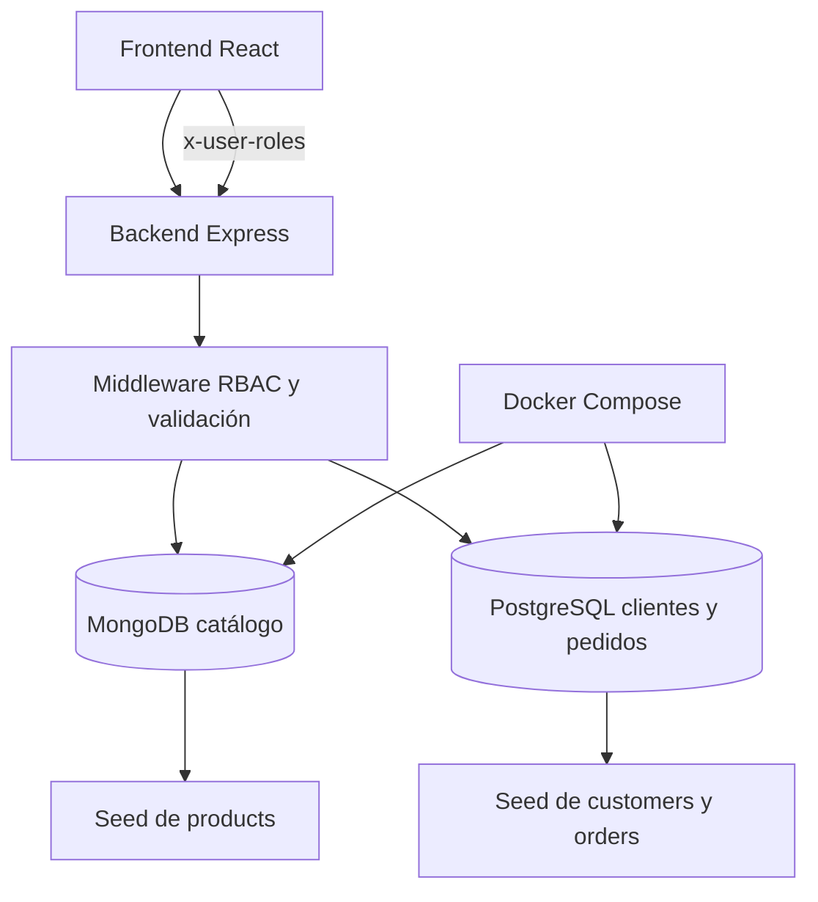

# Guía De Integración

Este documento resume cómo se conectan frontend, backend y bases de datos en el proyecto.

## Componentes

- Frontend: React + Vite.
- Backend: Express con catálogo en MongoDB y módulo relacional en PostgreSQL.
- Infraestructura: Docker Compose para MongoDB, Mongo Express y PostgreSQL.

## Diagrama De Flujo



Fuente editable del diagrama: [docs/architecture-flow.mmd](docs/architecture-flow.mmd).

## Secuencia De Arranque Recomendada

1. `docker compose up -d`
2. `cd backend && npm run db:setup`
3. `cd backend && npm run dev`
4. `cd frontend && npm run dev`

## Qué Hace Cada Seed

- `db:create`: aplica el esquema de PostgreSQL.
- `db:seed:postgres`: carga customers y orders de ejemplo.
- `db:seed:mongo`: carga catálogo avanzado en MongoDB.
- `db:seed:prefs`: carga preferencias de ejemplo.
- `db:seed:carts`: carga carritos de ejemplo.
- `db:setup`: ejecuta toda la preparación en cadena.

## Checkout Transaccional

El endpoint `POST /api/orders/checkout/:customerId`:

1. Busca el customer en PostgreSQL.
2. Lee el carrito en MongoDB.
3. Calcula el total con productos vigentes.
4. Abre una transacción en PostgreSQL.
5. Inserta `orders` y `order_items`.
6. Hace `COMMIT` o `ROLLBACK` según el resultado.
7. Limpia el carrito en MongoDB una vez confirmado el pago.

## Contratos Clave

- El frontend usa `/api/*` con proxy de Vite.
- El backend espera `x-user-roles` para rutas protegidas de desarrollo.
- Los endpoints de catálogo devuelven `id` normalizado para el frontend.
- Los customers guardan `encrypted_card` y `card_last4`, nunca la tarjeta en claro.

## Rutas Útiles Para Pruebas

- `GET /api/products/catalog`
- `GET /api/products/facets`
- `GET /api/reports/price-summary?category=apparel` con `x-user-roles: admin`
- `GET /api/customers/:id/full` con `x-user-roles: admin`
- `POST /api/orders/checkout/:customerId`

## Casos De Uso

### 1. Ver catálogo y facetas

```bash
curl http://localhost:4000/api/products/catalog
curl http://localhost:4000/api/products/facets
```

### 2. Probar RBAC en reportes

```bash
curl -H "x-user-roles: admin" http://localhost:4000/api/reports/price-summary?category=apparel
```

### 3. Crear un customer con tarjeta cifrada

```bash
curl -X POST http://localhost:4000/api/customers \
  -H "Content-Type: application/json" \
  -d '{"name":"Demo User","email":"demo.user@example.com","card":"4111111111111111"}'
```

### 4. Actualizar carritos y preferencias

```bash
curl -X POST http://localhost:4000/api/cart/11111111-1111-4111-8111-111111111111 \
  -H "Content-Type: application/json" \
  -d '{"items":[{"productId":"6a281e4dd775985e301f3029","quantity":2}]}'

curl -X POST http://localhost:4000/api/preferences/11111111-1111-4111-8111-111111111111 \
  -H "Content-Type: application/json" \
  -d '{"favorites":["training-ball-pro"],"preferredCategories":["equipment"],"metadata":{"language":"es"}}'
```

## Observaciones

- Si Docker cambia de puertos, actualiza `backend/.env.example` y `docker-compose.yml`.
- Si cambias el catálogo base, vuelve a ejecutar `npm run db:setup`.
- Usa `npm run db:verify-sql` para confirmar que las consultas siguen parametrizadas.